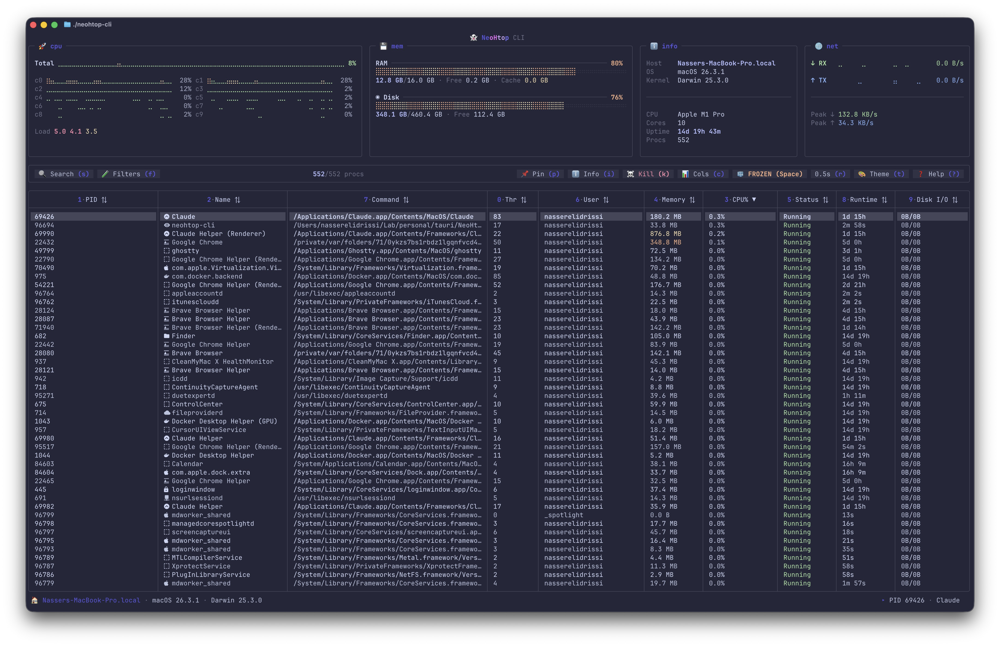

<h1 align="center">👻 NeoHtop CLI</h1>

<p align="center">
  <strong>A beautiful, feature-rich terminal process monitor</strong><br/>
  The CLI companion to <a href="https://github.com/Abdenasser/NeoHtop">NeoHtop</a> — built with Go + the <a href="https://charm.sh">Charm</a> ecosystem
</p>

<p align="center">
  <a href="#installation">Installation</a> •
  <a href="#features">Features</a> •
  <a href="#keybindings">Keybindings</a> •
  <a href="#themes">Themes</a> •
  <a href="#configuration">Configuration</a> •
  <a href="#contributing">Contributing</a>
</p>

---

<p align="center">
  
</p>

<p align="center">
  
</p>

## Features

- **Real-time monitoring** — CPU per-core sparklines, memory, disk I/O, and network stats with braille-dot visualizations
- **Powerful search** — regex-powered filtering (`^chrome`, `name|pid`, `\.log$`) with live match highlighting
- **15 built-in themes** — Catppuccin, Dracula, Tokyo Night, Nord, Gruvbox, Synthwave, and more
- **Process management** — inspect details, kill processes, pin favorites to the top
- **Process tree view** — toggle with `T` to see parent/child relationships with tree connectors
- **JSON output** — `neohtop-cli --json` for scripting and piping to `jq`
- **Responsive UI** — adapts from ultra-wide to 80-column terminals with smart compact modes
- **Cross-platform** — macOS, Linux, and Windows support
- **Single binary** — no dependencies, just download and run

## Installation

### npm (easiest)

```bash
npm install -g neohtop-cli
```

### Download a release

Grab the latest binary from the [Releases page](https://github.com/Abdenasser/neohtop-cli/releases):

**macOS (Apple Silicon)**
```bash
curl -LO https://github.com/Abdenasser/neohtop-cli/releases/latest/download/neohtop-cli-macos-arm64.tar.gz
tar xzf neohtop-cli-macos-arm64.tar.gz
sudo mv neohtop-cli-macos-arm64 /usr/local/bin/neohtop-cli
```

**macOS (Intel)**
```bash
curl -LO https://github.com/Abdenasser/neohtop-cli/releases/latest/download/neohtop-cli-macos-amd64.tar.gz
tar xzf neohtop-cli-macos-amd64.tar.gz
sudo mv neohtop-cli-macos-amd64 /usr/local/bin/neohtop-cli
```

**Linux (x86_64)**
```bash
curl -LO https://github.com/Abdenasser/neohtop-cli/releases/latest/download/neohtop-cli-linux-amd64.tar.gz
tar xzf neohtop-cli-linux-amd64.tar.gz
sudo mv neohtop-cli-linux-amd64 /usr/local/bin/neohtop-cli
```

**Linux (ARM64)**
```bash
curl -LO https://github.com/Abdenasser/neohtop-cli/releases/latest/download/neohtop-cli-linux-arm64.tar.gz
tar xzf neohtop-cli-linux-arm64.tar.gz
sudo mv neohtop-cli-linux-arm64 /usr/local/bin/neohtop-cli
```

**Windows (x86_64)**

Download `neohtop-cli-windows-amd64.zip` from the [latest release](https://github.com/Abdenasser/neohtop-cli/releases/latest), extract it, and add the folder to your PATH.

### Build from source

Requires [Go 1.25+](https://go.dev/dl) and a C compiler (gcc/clang) for CGo.

```bash
git clone https://github.com/Abdenasser/neohtop-cli.git
cd neohtop-cli
make build
./neohtop-cli
```

To install to your PATH:

```bash
make install  # copies to /usr/local/bin/
```

## Quick Start

```bash
./neohtop-cli
```

That's it. NeoHtop CLI launches in your terminal with real-time system monitoring. Press `?` to see all keybindings.

## UI Overview

```
👻 NeoHtop CLI                         ← gradient branding
╭─ 🚀 cpu ──────╮╭─ 💾 mem ──╮╭─ ℹ️ info ─╮╭─ 🌐 net ──╮
│ ⣿⣿⣶⣦ 45.2%    ││ RAM 67%   ││ Host     ││ ↓ 1.2MB/s │  ← stats panels
│ per-core bars  ││ 8G/16G   ││ macOS    ││ ↑ 340KB/s │
╰────────────────╯╰──────────╯╰──────────╯╰───────────╯
╭─────────────────────────────────────────────────────────╮
│ 🔍 Search (s)  🧪 Filters (f)  42/320 procs  ...       │  ← toolbar
╰─────────────────────────────────────────────────────────╯
╭─────────────────────────────────────────────────────────╮
│ 1·PID  2·Name       3·CPU%       4·Memory  5·Status    │  ← sortable headers
│ 1234   󰊯 chrome     45.2% ▋▋▎   1.2 GB    Running     │  ← with CPU mini-bars
│ 5678   📌󰎙 node      12.0% ▎     340 MB    Running     │  ← pinned process
│ ...                                                     │
╰─────────────────────────────────────────────────────────╯
🏠 hostname · macOS 15.3 · Darwin 24.3     ▸ PID 1234 chrome  ← footer
```

## Keybindings

### General

| Key | Action |
|-----|--------|
| `q` / `Ctrl+C` | Quit |
| `?` | Help overlay |
| `s` / `/` | Search (regex) |
| `Space` | Pause / resume updates |
| `Esc` | Close overlay / clear search |

### Navigation

| Key | Action |
|-----|--------|
| `↑` `↓` `j` `k` | Move selection |
| `PgUp` / `PgDn` | Scroll fast |
| `Home` / `g` | Jump to top |
| `End` / `G` | Jump to bottom |

### Process Actions

| Key | Action |
|-----|--------|
| `i` / `Enter` | Process details |
| `k` / `x` / `Del` | Kill process (with confirmation) |
| `p` | Pin / unpin process |

### Display

| Key | Action |
|-----|--------|
| `0`-`9` | Sort by column (shown in headers) |
| `f` | Filter panel |
| `c` | Column visibility |
| `T` | Toggle process tree view |
| `t` | Theme selector |
| `r` | Cycle refresh rate (1s → 2s → 3s → 5s → 0.5s) |

### Mouse

| Action | Effect |
|--------|--------|
| Click row | Select process |
| Double-click | Open details |
| Click header | Sort by column |
| Scroll wheel | Navigate list |

## Search

NeoHtop CLI supports full regex search. Press `s` or `/` to start typing.

| Pattern | Matches |
|---------|---------|
| `chrome` | Processes containing "chrome" |
| `^sys` | Names starting with "sys" |
| `\.log$` | Commands ending in ".log" |
| `name\|pid` | Processes matching "name" or "pid" |
| `1234` | Process with PID 1234 |

Matching text is highlighted in yellow in the Name and Command columns.

## Themes

NeoHtop CLI ships with 15 themes. Press `t` to open the theme selector with live color swatches.

| Theme | Style |
|-------|-------|
| **Charm** (default) | Tokyo Night-inspired dark |
| **Catppuccin Mocha** | Warm dark pastels |
| **Catppuccin Latte** | Light mode |
| **Dracula** | Purple-focused dark |
| **Tokyo Night** | Cool modern dark |
| **Gruvbox Dark** | Retro warm tones |
| **Nord** | Arctic blue dark |
| **One Dark** | Atom editor theme |
| **Rosé Pine** | Soft muted dark |
| **Synthwave** | Cyberpunk neon |
| **Solarized Dark** | Precision color science |
| **Monokai Pro** | Classic editor dark |
| **High Contrast** | Accessibility-focused |
| **Green Terminal** | Retro CRT green |
| **Amber Terminal** | Retro CRT amber |

## JSON Output

Use `--json` to get a single snapshot of system stats and all processes as structured JSON. Perfect for scripting, monitoring pipelines, or custom dashboards:

```bash
# All processes using more than 5% CPU
neohtop-cli --json | jq '.processes[] | select(.cpu_usage > 5)'

# Top 10 by CPU usage
neohtop-cli --json | jq '[.processes[] | {name, cpu: .cpu_usage}] | sort_by(.cpu) | reverse[:10]'

# Current memory usage
neohtop-cli --json | jq '.system | {memory_used, memory_total, pct: (.memory_used/.memory_total*100|round)}'

# Watch mode (refresh every 2s)
watch -n2 'neohtop-cli --json | jq ".system.cpu_usage_per_core"'
```

## Configuration

Settings are persisted at `~/.config/neohtop-cli/config.json`:

```json
{
  "columns": ["pid", "name", "cpu", "memory", "status", "user", "command"],
  "refresh_rate_ms": 1000,
  "theme": "charm"
}
```

### Available Columns

`pid`, `name`, `cpu`, `memory`, `status`, `user`, `command`, `threads`, `runtime`, `disk`

### Refresh Rates

Cycle through with `r`: 1s (default) → 2s → 3s → 5s → 0.5s

## Architecture

NeoHtop CLI is a pure Go application using native OS APIs for process and system monitoring.

```
┌─────────────────────────────────────────┐
│         Go TUI (Bubble Tea v2)          │
│                                         │
│  Stats Bar  │  Toolbar  │  Process Table│
│  (sparklines, braille bars, panels)     │
├─────────────────────────────────────────┤
│         Native Go Monitor               │
│  process_darwin.go  │  system_darwin.go  │
│  process_linux.go   │  system_linux.go   │
│  process_windows.go │  system_windows.go │
└─────────────────────────────────────────┘
```

### Tech Stack

- **TUI Framework**: [Bubble Tea v2](https://github.com/charmbracelet/bubbletea) — Elm-inspired Go TUI
- **Styling**: [Lip Gloss v2](https://github.com/charmbracelet/lipgloss) — CSS-like terminal styling
- **Visualizations**: Braille dot-matrix (U+2800–U+28FF) for btop-style charts
- **Table**: [lipgloss/table](https://github.com/charmbracelet/lipgloss) — responsive column layout

### Project Structure

```
NeoHtopCLI/
├── cli/                      # Go application
│   ├── main.go               # Entry point
│   ├── model/                # Bubble Tea model (app state + update loop)
│   ├── view/                 # UI components
│   │   ├── stats_bar.go      # CPU, memory, network, info panels
│   │   ├── toolbar.go        # Button bar with shortcuts
│   │   ├── process_table.go  # Main data grid
│   │   ├── footer.go         # Status footer
│   │   ├── sparkline.go      # Time-series sparklines
│   │   ├── bar.go            # Braille progress bars
│   │   ├── help.go           # Keybinding reference overlay
│   │   ├── process_details.go# Process info modal
│   │   ├── kill_confirm.go   # Kill confirmation dialog
│   │   ├── filter_panel.go   # Filter configuration
│   │   ├── column_panel.go   # Column visibility toggle
│   │   ├── theme_panel.go    # Theme selector with swatches
│   │   ├── process_icons.go  # 140+ Nerd Font app icons
│   │   ├── icons.go          # Unicode icon constants
│   │   └── format.go         # Value formatting utilities
│   ├── monitor/              # OS-specific system monitoring
│   ├── theme/                # 15 color themes
│   ├── filter/               # Search, filter, and sort logic
│   └── config/               # Persistent user settings
├── core/                     # Rust monitoring library (reference, not used in CLI build)
├── Makefile
├── README.md
└── CONTRIBUTING.md
```

## Comparison with NeoHtop Desktop

| Feature | NeoHtop Desktop | NeoHtop CLI |
|---------|----------------|-------------|
| Process monitoring | ✅ | ✅ |
| CPU per-core stats | ✅ | ✅ (sparklines) |
| Memory / Disk / Network | ✅ | ✅ |
| Search (regex) | ✅ | ✅ (with highlighting) |
| Process details | ✅ | ✅ |
| Kill processes | ✅ | ✅ |
| Pin processes | ✅ | ✅ |
| Process tree view | ❌ | ✅ |
| JSON output (scripting) | ❌ | ✅ |
| Themes | ✅ (12) | ✅ (15) |
| Runs in terminal | ❌ | ✅ |
| No Tauri/WebView needed | ❌ | ✅ |
| Single binary | ❌ | ✅ |
| Mouse support | ✅ | ✅ |

## Related

- [NeoHtop](https://github.com/Abdenasser/NeoHtop) — The desktop app (Tauri + Svelte)
- [btop](https://github.com/aristocratos/btop) — Inspiration for the braille visualization style
- [Bubble Tea](https://github.com/charmbracelet/bubbletea) — The TUI framework powering this project

## License

MIT — see [LICENSE](LICENSE) for details.

---

<p align="center">
  Made with 👻 by <a href="https://github.com/Abdenasser">Abdenasser</a>
</p>
